<p align="center">
  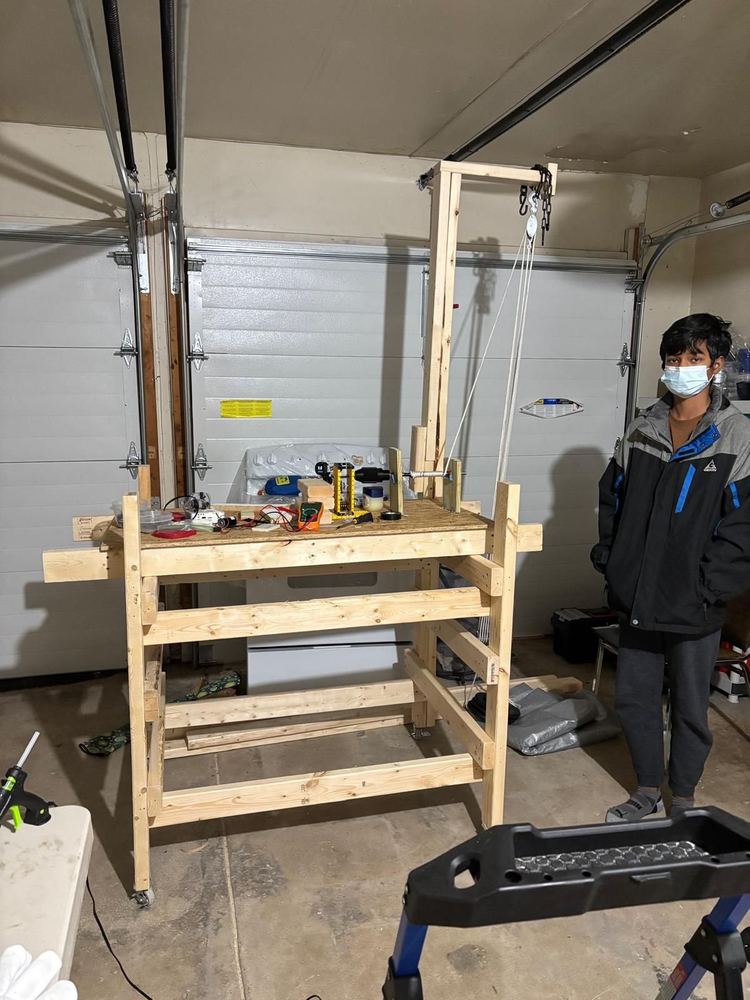
</p>

<h1 align="center">EcoDrop</h1>

<p align="center">
  <b>Amaan S. Khan · Aiman Ullah · Kavin Paturu Muralikrishnan</b><br>
  Chantilly High School · 2024 – present<br>
  <a href="https://squiddyscripts.github.io/ecodrop/">Project site</a> · <a href="documents/logbook/EcoDropGravity_Engineering_Logbook.pdf">Engineering logbook (PDF)</a>
</p>

---

### Abstract

*Gravitational Storage–Regeneration Systems* · [`documents/abstracts/`](documents/abstracts/)

This study evaluates the energy efficiency of four small-scale gravitational storage–regeneration concepts — buoyant displacement, electromagnetic assist, dual-weight counterbalance, and variable counterweight — using a MATLAB simulation with strict end-to-end energy bookkeeping. Each design is modeled under identical baseline conditions and assessed by generated electrical energy per drop, electrical energy required for lift, round-trip efficiency (E<sub>out</sub>/E<sub>in</sub> and E<sub>out</sub>/(mgh)), peak power, and detailed loss attribution. The analysis ranks concepts by realistic round-trip efficiency and identifies dominant mechanical and electrical loss channels. It also evaluates when active control elements produce a net benefit after accounting for coil and actuation energy. Reproducible test protocols and parameter files are provided to guide prototype selection and future experimental validation.

---

## Year 1 — we actually built it

<p align="center">
  
  &nbsp;
  
  &nbsp;
  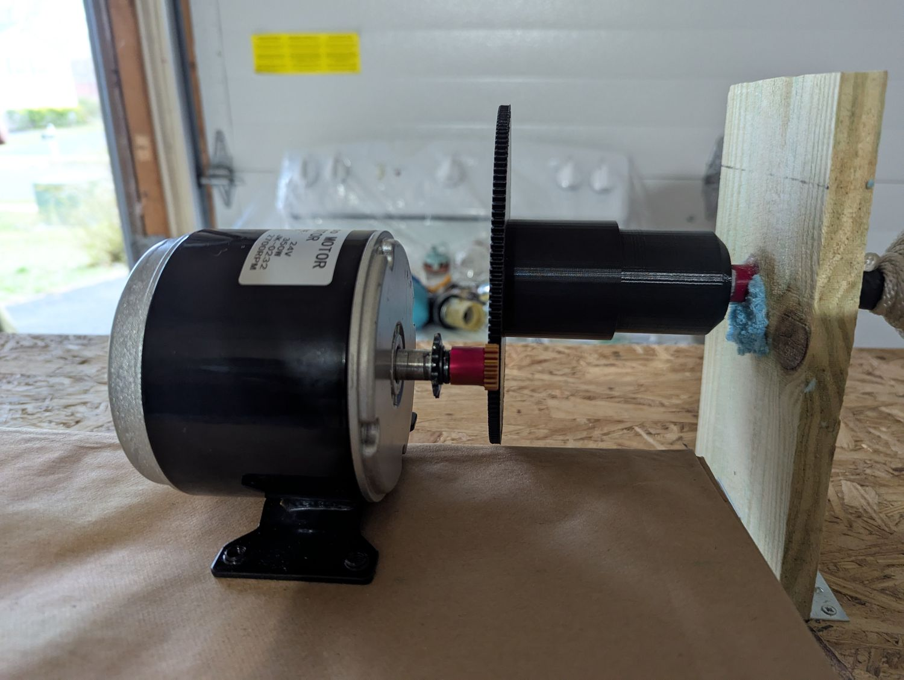
</p>

~9 ft wooden frame. Weed-whacker spool → cleated hoist drum. Vex/Lego gearbox → 3D-printed double-helix spur. Brushed DC → Turnigy SK3 BLDC. Multimeter trials at 10–25 kg.

| What we measured | Value |
|------------------|-------|
| Peak end-to-end efficiency | **28.7 %** at 25 kg |
| Average electrical output | **~45 W** at 25 kg |
| Raw data | [`prototype-2024-25/data/measured_results.csv`](prototype-2024-25/data/measured_results.csv) |

<p align="center">
  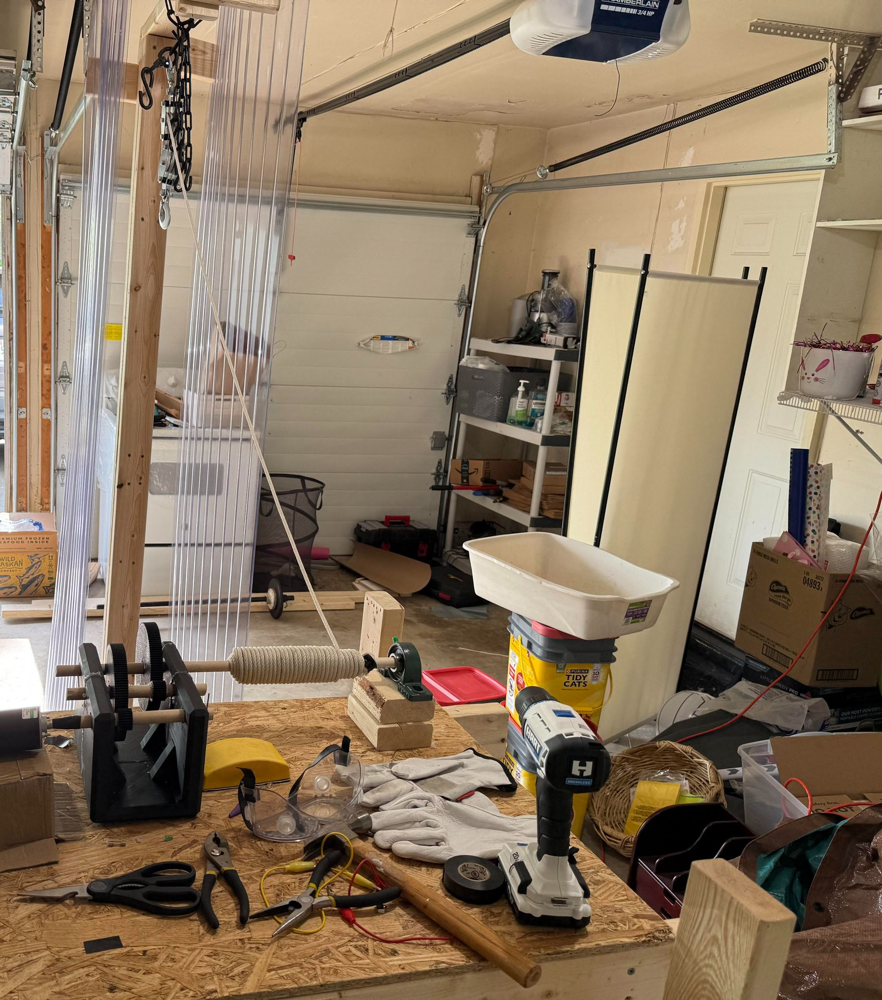
  &nbsp;
  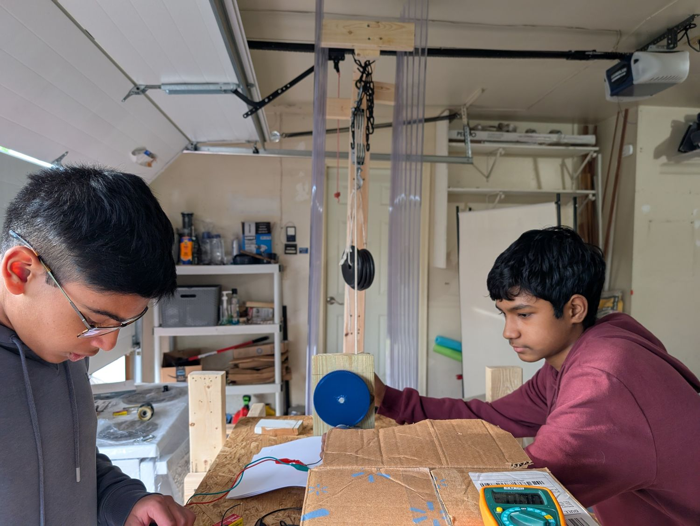
</p>

Every failed iteration is in the [**engineering logbook**](documents/logbook/EcoDropGravity_Engineering_Logbook.pdf) — gearbox v1 through v4, spool redesign, motor swap, weight box, couplers.

<p align="center">
  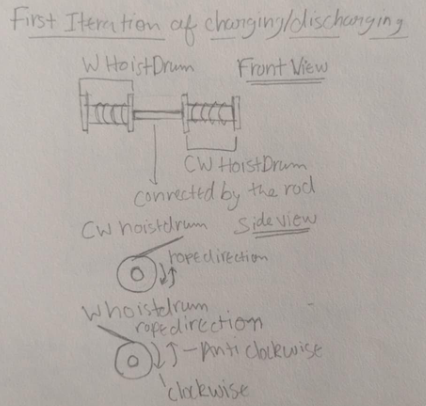
  
  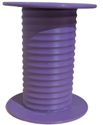
</p>

→ Full Year 1 folder: [`prototype-2024-25/`](prototype-2024-25/)

---

## Year 2 — four ways to store gravity

After the prototype worked, the question changed: **which architecture makes small-scale gravity storage practical?**

Four systems, same baseline (50 kg, 3 m drop, same motor model), modeled in MATLAB. Diagrams and CAD below are from the engineering logbook and Onshape.

| System | Simulated discharge efficiency |
|--------|-------------------------------|
| **Variable counterweight** | **77.0 ± 0.5 %** |
| **Dual weight** | 60.0 ± 1.2 % |
| **Buoyancy** | 39.5 ± 1.8 % |
| **Halbach linear** | 27.0 ± 2.1 % |

### 1 · Variable counterweight — **77.0 ± 0.5 %**

Modular masses deploy/retract so the counterweight matches the load. Motor only pays for imbalance + friction.

<p align="center">
  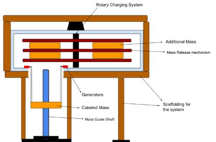
  &nbsp;
  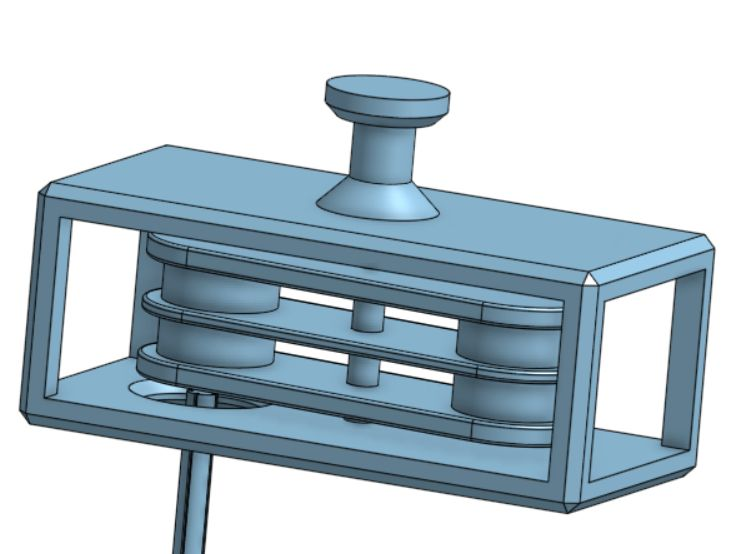
</p>

<p align="center">
  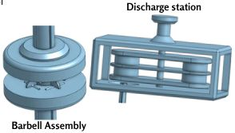
  &nbsp;
  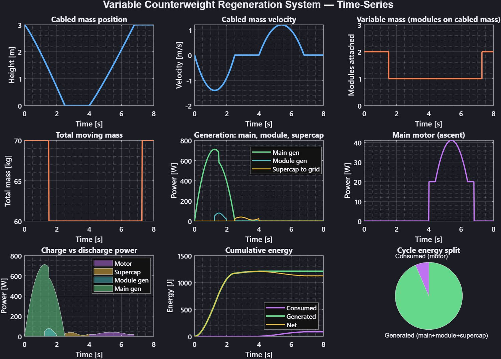
</p>

### 2 · Dual weight — **60.0 ± 1.2 %**

Two hoist drums, opposite rope wind — generate on both directions of travel (elevator-style regen).

<p align="center">
  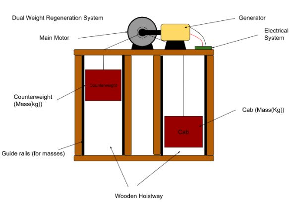
</p>

### 3 · Buoyancy — **39.5 ± 1.8 %**

Flood a chamber to lift the mass (Archimedes), then discharge through the generator / turbine path.

<p align="center">
  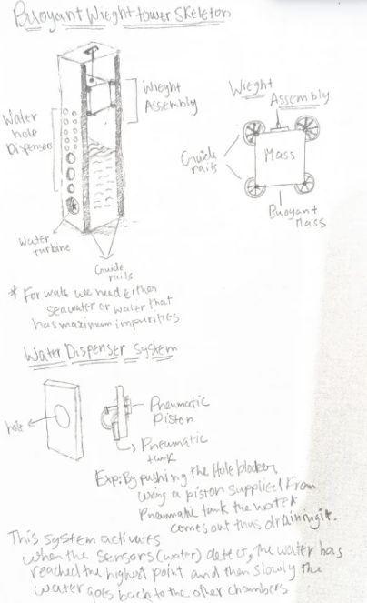
  &nbsp;
  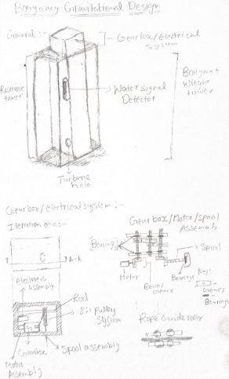
</p>

### 4 · Halbach linear (electromagnetic) — **27.0 ± 2.1 %**

Tubular quasi-Halbach magnets lift the mass with no ropes. Lowest simulated efficiency — current design focus for Year 3.

<p align="center">
  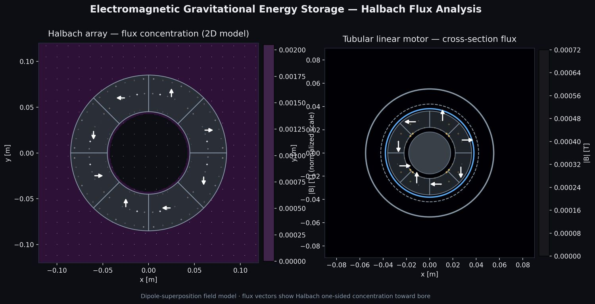
</p>

<p align="center">
  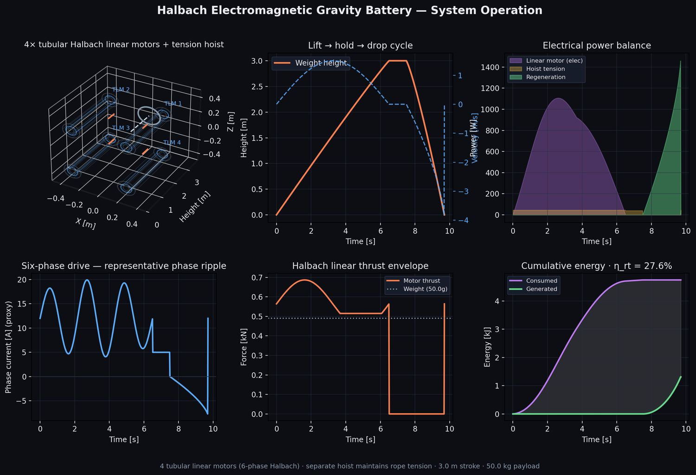
  &nbsp;
  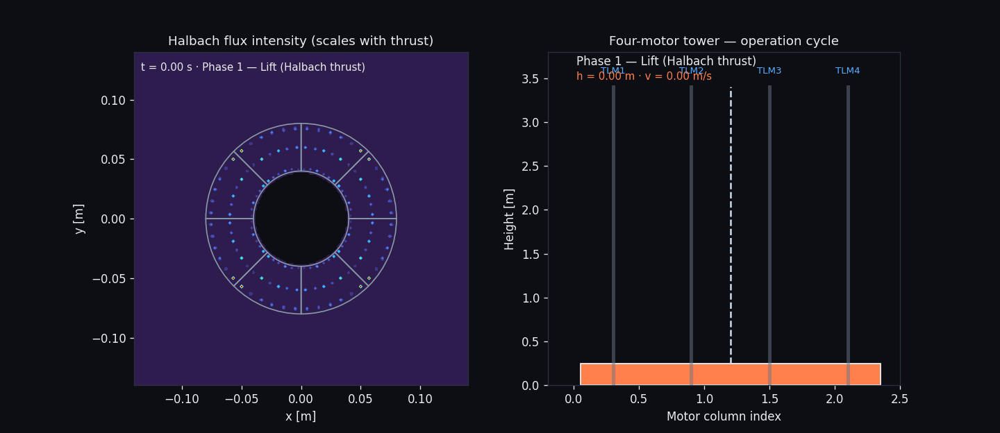
</p>

### Comparison figures

<p align="center">
  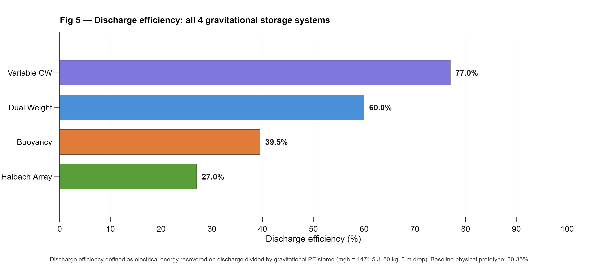
  &nbsp;
  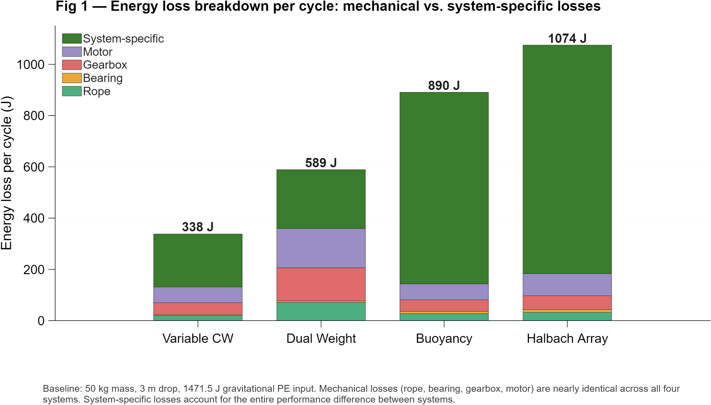
</p>

<p align="center">
  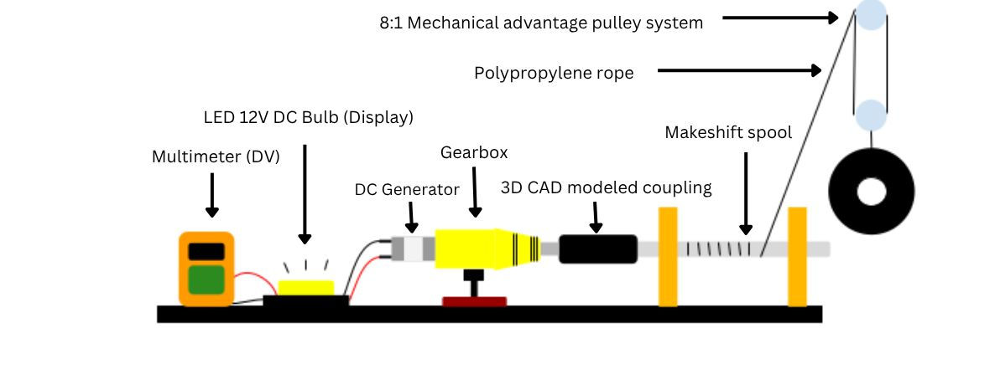
</p>

None of these four exist as full physical machines yet — CAD + simulation + demos. Year 1 prototype data is what calibrated the models.

→ [`four-systems-2025-26/`](four-systems-2025-26/) · [`PROVENANCE.md`](PROVENANCE.md)

---

## Year 3 — electromagnetic + elevator retrofit (in progress)

T-shaped quasi-Halbach tubular linear machine + elevator machine-room integration. Concept paper draft in LaTeX.

<p align="center">
  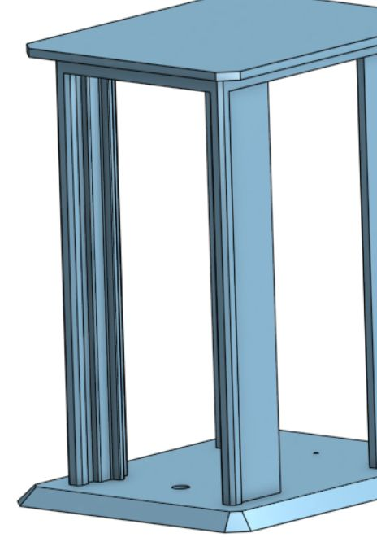
  &nbsp;
  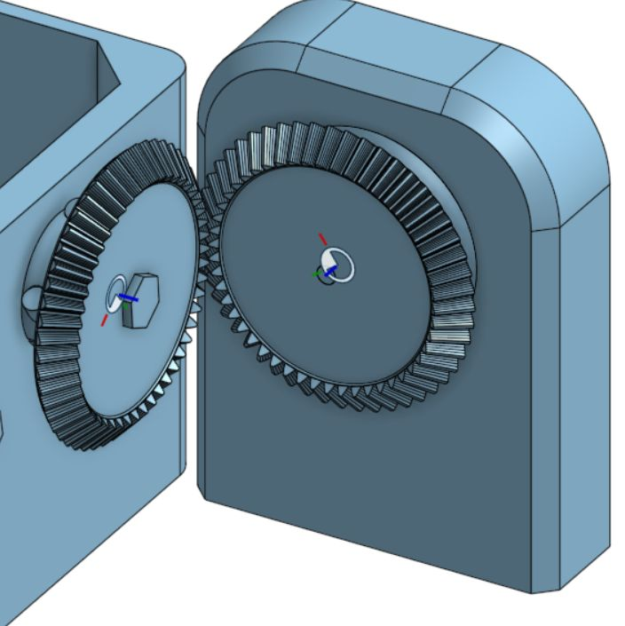
</p>

→ [`documents/concept-paper/`](documents/concept-paper/) · [`interactive-demos/`](interactive-demos/) (Three.js demos you can run locally)

**Project site versions:** the live GitHub Pages page is `docs/index.html`. Older layouts are saved under [`docs/archive/`](docs/archive/) so you can switch later without losing either one.

---

## Competitions

### Fairfax County Regional Science & Engineering Fair · March 2026

<p align="center">
  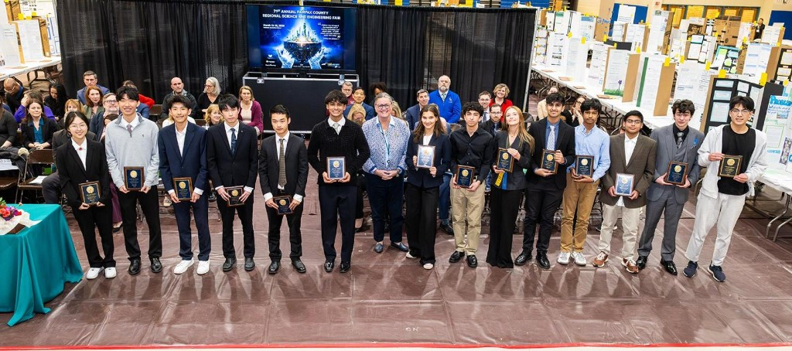
</p>

### Invention Convention U.S. Nationals · June 2026

<p align="center">
  
  &nbsp;&nbsp;
  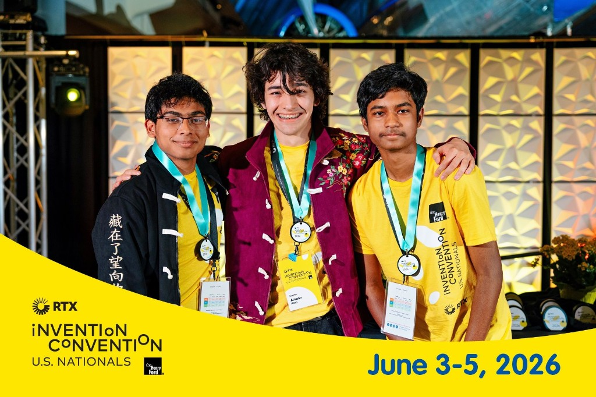
</p>

### Regeneron ISEF · 2026

<p align="center">
  
  &nbsp;&nbsp;
  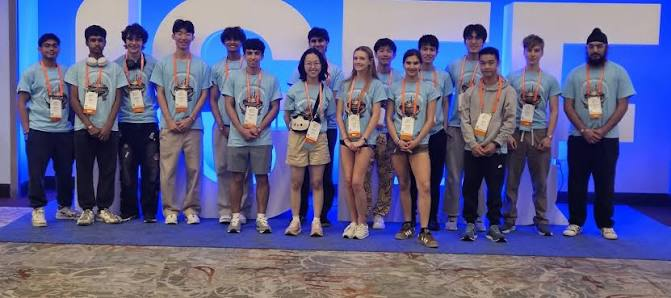
</p>

Backboards, event photos, videos: [`competitions/`](competitions/) · full photo gallery on the [project site](https://squiddyscripts.github.io/ecodrop/gallery.html)

---

## Technical documentation

| Document | Path |
|----------|------|
| **Engineering logbook** (component-by-component iteration history) | [`documents/logbook/EcoDropGravity_Engineering_Logbook.pdf`](documents/logbook/EcoDropGravity_Engineering_Logbook.pdf) |
| **LaTeX technical documentation** (equations, drivetrain ODE, per-file reference) | [`four-systems-2025-26/latex/TECHNICAL_DOCUMENTATION.pdf`](four-systems-2025-26/latex/TECHNICAL_DOCUMENTATION.pdf) |
| **Provenance map** (measured vs simulated vs conceptual for every number) | [`PROVENANCE.md`](PROVENANCE.md) |
| **Timeline** (dated chronology from file evidence) | [`TIMELINE.md`](TIMELINE.md) |
| **Abstracts & research plans** | [`documents/`](documents/) |
| **Annotated bibliography** | [`research/`](research/) |

---

## Run the code

**MATLAB** (R2016b+):

```matlab
% Final four-system pipeline (numbers used on backboard)
cd four-systems-2025-26/simulation-four-systems
addpath('matlab'); addpath('matlab/systems');
run_presentation_plots_dark
main
```

**Interactive demos** (Node 18+):

```bash
cd interactive-demos && npm install && npm run dev
# http://127.0.0.1:5190/
```

**Halbach figures** (Python 3.10+):

```bash
cd interactive-demos/halbach-viz && pip install -r requirements.txt && python run_all.py
```

**Year 1 data analysis**:

```bash
cd prototype-2024-25/analysis && python gravenv.py
```

---

## Repository layout

```
prototype-2024-25/      Build photos, multimeter data, Python analysis, 3D prints, Blender
four-systems-2025-26/   Both MATLAB codebases, LaTeX docs, presentation figures
interactive-demos/      Three.js lab + Python Halbach viz (source — not the built copy)
documents/              Logbook, abstracts, research plans, concept paper, notes
cad/                    Onshape screenshots, renders, credited third-party models
competitions/           Backboards, event photos/videos
research/               Bibliography, reference papers
docs/                   GitHub Pages site
```

---

## Authors

**Amaan S. Khan · Aiman Ullah · Kavin Paturu Muralikrishnan**

Attribution details: [`AUTHORS.md`](AUTHORS.md)
