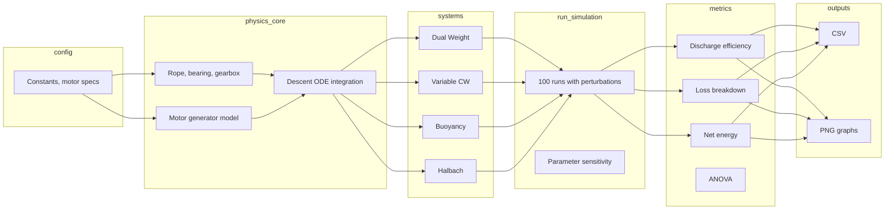

# EcoDrop Gravity Battery — Documentation

Documentation for the MATLAB simulation and results.

---

## Data and control flow

How the pieces connect (config → physics → systems → runs → metrics → outputs):

*(Rendered in any Markdown viewer that supports Mermaid, e.g. GitHub or VS Code.)*

---

## Doc index

| Doc | Description |
|-----|--------------|
| [matlab/README.md](../matlab/README.md) | MATLAB file list, ODE description, how to run, outputs |
| [GRAPH_EXPLANATIONS.md](GRAPH_EXPLANATIONS.md) | What each figure shows (for presentation or reporting) |
| [WHY_DISCHARGE_EFFICIENCY.md](WHY_DISCHARGE_EFFICIENCY.md) | Why we use discharge efficiency instead of RTE |
| [PRESENTATION_SCRIPT_2MIN.md](PRESENTATION_SCRIPT_2MIN.md) | 2-minute script and figure order for presenting results |
